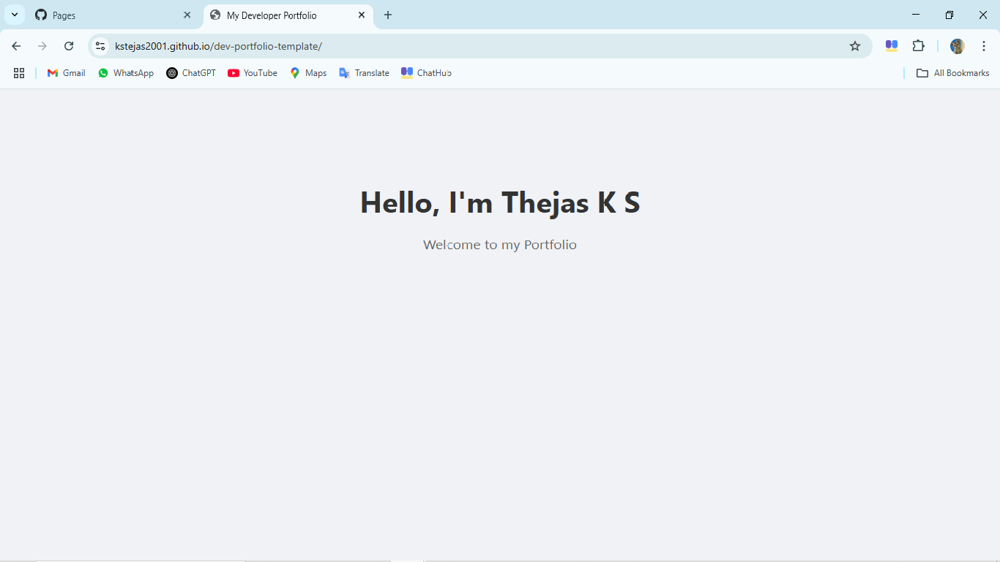

# 💼 Dev Portfolio Template

Welcome to my personal developer portfolio website!  
This is a responsive and modern portfolio template built with **HTML**, **CSS**, and **JavaScript**. It showcases my skills, projects, and contact information in a clean layout.

## 🔥 Features

- Responsive design
- Animated scroll effects
- Clean and minimal layout
- Contact form
- Easily customizable

## 🚀 Technologies Used

- HTML5
- CSS3
- JavaScript

## 📁 Project Structure

dev-portfolio-template/
├── index.html
├── about.html
├── contact.html
├── css/
│   └── style.css
├── js/
│   └── script.js
├── assets/
│   ├── images/

## 📷 Preview

> 

## 🌐 Live Demo

> [🔗 View Portfolio](https://kstejas2001.github.io/dev-portfolio-template/)

## 📬 Connect with Me

- GitHub: [@kstejas2001](https://github.com/kstejas2001)
- Gmail: [kstejas2001@gmail.com](mailto:kstejas2001@gmail.com)

---

Thank you for visiting! ⭐ If you like it, feel free to star this repo!
